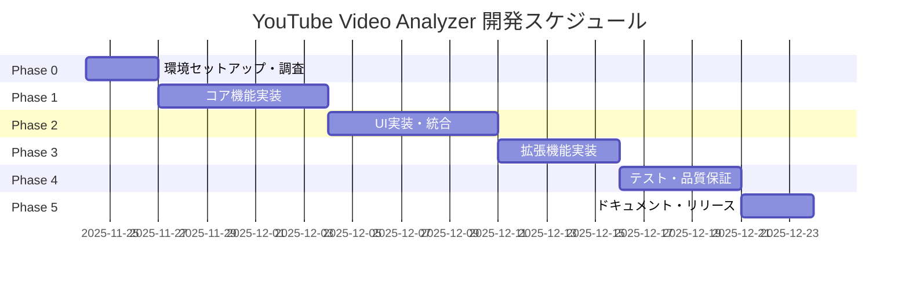
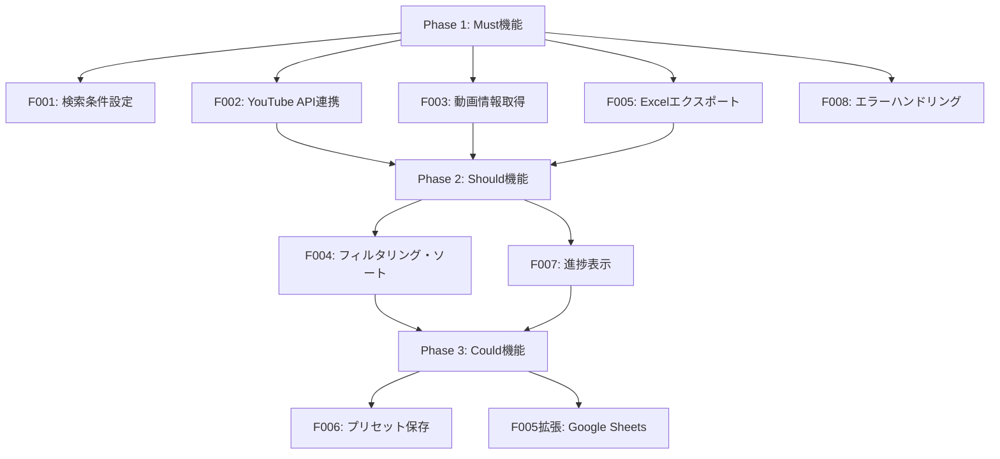
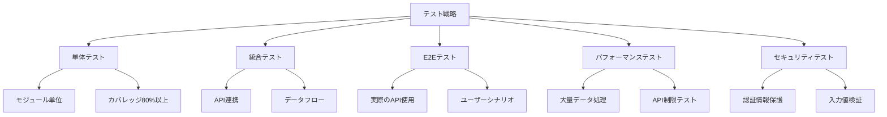

# YouTube Video Analyzer & Exporter 実装計画書

**要件定義書バージョン**: 1.0
**実装計画書バージョン**: 1.0
**作成日**: 2025-11-24
**対象システム**: YouTube動画情報収集・Excel/スプレッドシート出力アプリ

---

## 目次
1. [プロジェクト全体の実装方針](#1-プロジェクト全体の実装方針)
2. [開発フェーズとマイルストーン](#2-開発フェーズとマイルストーン)
3. [機能別実装計画](#3-機能別実装計画)
4. [データ層の実装計画](#4-データ層の実装計画)
5. [インフラ・デプロイ計画](#5-インフラデプロイ計画)
6. [テスト計画](#6-テスト計画)
7. [品質保証・レビュー計画](#7-品質保証レビュー計画)
8. [リスク対策と技術的課題への対応](#8-リスク対策と技術的課題への対応)
9. [ドキュメンテーション計画](#9-ドキュメンテーション計画)
10. [実装タスクリスト](#10-実装タスクリスト)

---

## 1. プロジェクト全体の実装方針

### 1.1 アーキテクチャの選定理由

**選定アーキテクチャ**: レイヤードアーキテクチャ（階層型）

```
┌─────────────────────────────────┐
│    UI Layer (Presentation)      │  ← Tkinter/PyQt/Electron
├─────────────────────────────────┤
│   Application Layer (Logic)     │  ← ビジネスロジック
├─────────────────────────────────┤
│   Domain Layer (Models)          │  ← データモデル
├─────────────────────────────────┤
│   Infrastructure Layer           │  ← YouTube API, File I/O
└─────────────────────────────────┘
```

**選定理由**:
1. **保守性**: 各層が独立しており、変更の影響範囲が限定的
2. **テスタビリティ**: 各層を独立してテスト可能（モック化が容易）
3. **拡張性**: 新機能追加や出力形式追加が容易
4. **学習コスト**: シンプルで理解しやすい構造
5. **将来のWebアプリ化**: UI層を置き換えるだけで対応可能

### 1.2 技術スタックの決定

#### **最終選定**: Python 3.10+ ベース

| カテゴリ | 技術 | バージョン | 選定理由 |
|---------|------|-----------|---------|
| **言語** | Python | 3.10以上 | ・豊富なライブラリエコシステム<br>・YouTube/Google API公式サポート<br>・学習コスト低<br>・クロスプラットフォーム対応 |
| **GUI** | Tkinter | 標準ライブラリ | ・追加インストール不要<br>・シンプルなUI要件に最適<br>・クロスプラットフォーム対応<br>・軽量 |
| **YouTube API** | google-api-python-client | 2.100+ | ・Google公式ライブラリ<br>・安定性と信頼性<br>・豊富なドキュメント |
| **Excel出力** | openpyxl | 3.1+ | ・.xlsx形式対応<br>・豊富な書式設定機能<br>・ハイパーリンク対応 |
| **Google Sheets** | gspread | 5.11+ | ・シンプルなAPI<br>・OAuth 2.0対応<br>・バッチ書き込み対応 |
| **データベース** | SQLite | 3.x (標準) | ・追加インストール不要<br>・軽量<br>・単一ユーザー用途に最適 |
| **設定管理** | python-dotenv | 1.0+ | ・環境変数管理<br>・セキュアな認証情報管理 |
| **ログ** | logging | 標準ライブラリ | ・強力なログ機能<br>・ファイル出力対応 |
| **日付処理** | datetime | 標準ライブラリ | ・標準的な日付処理 |
| **データ処理** | pandas (オプション) | 2.0+ | ・データ操作が容易<br>・Excelエクスポート強化 |

#### 代替案（将来的な検討）
- **GUI**: PyQt5/PySide6（より高度なUI要件が発生した場合）
- **Webアプリ化**: Flask/FastAPI + React（将来的なWeb化）

### 1.3 開発環境のセットアップ手順

#### 必要な環境
- Python 3.10以上
- pip（パッケージマネージャー）
- Git（バージョン管理）
- YouTube Data API v3のAPIキー
- Google Cloud Console プロジェクト（Google Sheets使用時）

#### セットアップスクリプト

```bash
# 1. リポジトリクローン（または作成）
git clone <repository-url>
cd youtube-video-analyzer

# 2. 仮想環境作成
python -m venv venv

# 3. 仮想環境有効化
# Windows
venv\Scripts\activate
# Mac/Linux
source venv/bin/activate

# 4. 依存パッケージインストール
pip install -r requirements.txt

# 5. 環境変数設定
cp .env.example .env
# .envファイルにYouTube APIキーを設定

# 6. データベース初期化
python src/database/init_db.py

# 7. 動作確認
python src/main.py --test
```

#### requirements.txt
```
google-api-python-client==2.100.0
google-auth-httplib2==0.1.1
google-auth-oauthlib==1.1.0
openpyxl==3.1.2
gspread==5.11.3
python-dotenv==1.0.0
```

#### 開発用追加パッケージ（requirements-dev.txt）
```
pytest==7.4.3
pytest-mock==3.12.0
pytest-cov==4.1.0
black==23.11.0
flake8==6.1.0
mypy==1.7.0
```

### 1.4 コーディング規約・スタイルガイド

#### 基本方針
- **PEP 8準拠**: Pythonの標準スタイルガイドに従う
- **Black**: コードフォーマッターで自動整形
- **型ヒント**: Python 3.10+の型ヒントを積極的に使用

#### 命名規則
```python
# クラス名: PascalCase
class VideoSearcher:
    pass

# 関数・変数名: snake_case
def search_videos(keyword: str) -> list:
    max_results = 50

# 定数: UPPER_SNAKE_CASE
MAX_RETRY_COUNT = 3
API_BASE_URL = "https://www.googleapis.com/youtube/v3"

# プライベートメソッド・変数: _prefix
def _validate_input(self, value):
    pass
```

#### ディレクトリ構成
```
youtube-video-analyzer/
├── src/
│   ├── __init__.py
│   ├── main.py                    # エントリーポイント
│   ├── ui/                        # UI層
│   │   ├── __init__.py
│   │   ├── main_window.py         # メインウィンドウ
│   │   ├── search_panel.py        # 検索条件パネル
│   │   ├── results_panel.py       # 結果表示パネル
│   │   └── progress_dialog.py     # 進捗ダイアログ
│   ├── application/               # アプリケーション層
│   │   ├── __init__.py
│   │   ├── search_service.py      # 検索サービス
│   │   ├── export_service.py      # エクスポートサービス
│   │   └── preset_service.py      # プリセット管理サービス
│   ├── domain/                    # ドメイン層
│   │   ├── __init__.py
│   │   ├── models.py              # データモデル
│   │   ├── enums.py               # 列挙型
│   │   └── validators.py          # バリデーター
│   ├── infrastructure/            # インフラ層
│   │   ├── __init__.py
│   │   ├── youtube_api.py         # YouTube API連携
│   │   ├── excel_exporter.py      # Excel出力
│   │   ├── sheets_exporter.py     # Googleスプレッドシート出力
│   │   └── database.py            # データベース操作
│   ├── utils/                     # ユーティリティ
│   │   ├── __init__.py
│   │   ├── logger.py              # ログ設定
│   │   ├── config.py              # 設定読み込み
│   │   └── exceptions.py          # カスタム例外
│   └── database/                  # データベース関連
│       ├── __init__.py
│       ├── init_db.py             # DB初期化
│       └── schema.sql             # テーブル定義
├── tests/                         # テストコード
│   ├── __init__.py
│   ├── unit/                      # 単体テスト
│   ├── integration/               # 統合テスト
│   └── fixtures/                  # テストデータ
├── docs/                          # ドキュメント
│   ├── user_manual.md             # ユーザーマニュアル
│   ├── api_reference.md           # API仕様
│   └── development_guide.md       # 開発ガイド
├── .env.example                   # 環境変数テンプレート
├── .env                           # 環境変数（.gitignore）
├── .gitignore                     # Git除外設定
├── requirements.txt               # 依存パッケージ
├── requirements-dev.txt           # 開発用パッケージ
├── setup.py                       # セットアップスクリプト
├── README.md                      # プロジェクト説明
└── LICENSE                        # ライセンス
```

#### コメント・ドキュメント
```python
def search_videos(
    keyword: str,
    min_views: int,
    video_type: VideoType = VideoType.ALL,
    max_results: int = 50
) -> list[VideoInfo]:
    """
    YouTube動画を検索して情報を取得する

    Args:
        keyword (str): 検索キーワード
        min_views (int): 最小再生回数
        video_type (VideoType): 動画タイプ（ALL/NORMAL/SHORT）
        max_results (int): 最大取得件数（デフォルト50）

    Returns:
        list[VideoInfo]: 動画情報のリスト

    Raises:
        YouTubeAPIError: API呼び出しエラー時
        ValidationError: 入力値検証エラー時

    Example:
        >>> videos = search_videos("AI 犬", 1000000, VideoType.SHORT)
        >>> len(videos)
        15
    """
    pass
```

---

## 2. 開発フェーズとマイルストーン

### フェーズ概要図



### Phase 0: 環境セットアップ・技術調査（3日）

**目標**: 開発環境の構築と技術検証を完了する

**成果物**:
- [ ] 開発環境セットアップ済み
- [ ] YouTube API動作確認済み
- [ ] プロジェクト構造作成済み
- [ ] 技術調査レポート

**主要タスク**:
1. Python環境構築
2. YouTube Data API v3の認証情報取得
3. APIキー動作確認（サンプルクエリ実行）
4. ショート動画識別方法の調査
5. プロジェクトディレクトリ構造作成
6. Git リポジトリ初期化
7. 基本的なロギング設定

**完了条件**:
- YouTube APIから動画情報を取得できること
- ショート動画の識別方法を特定できていること
- 開発チーム全員が環境構築完了していること

### Phase 1: コア機能実装（7日）

**目標**: Must機能の基礎部分（バックエンドロジック）を実装する

**成果物**:
- [ ] YouTube API連携モジュール
- [ ] 動画検索・情報取得機能
- [ ] Excelエクスポート機能
- [ ] データモデル定義
- [ ] 単体テスト（カバレッジ70%以上）

**主要タスク**:
1. データモデル実装（SearchCondition, VideoInfo等）
2. YouTube API連携クラス実装
3. 検索条件バリデーション実装
4. 動画情報取得ロジック実装
5. 再生回数フィルタリング実装
6. ショート動画判定ロジック実装
7. Excelエクスポーター実装
8. エラーハンドリング基盤実装
9. ロギング機能実装
10. 単体テスト作成

**完了条件**:
- CLIから検索→Excel出力が動作すること
- 単体テストが全てパスすること
- エラーハンドリングが適切に動作すること

### Phase 2: UI実装・統合（7日）

**目標**: GUIを実装し、バックエンドと統合する

**成果物**:
- [ ] Tkinterベースのデスクトップアプリ
- [ ] 検索条件入力UI
- [ ] 結果表示UI
- [ ] 進捗表示機能
- [ ] 統合テスト

**主要タスク**:
1. メインウィンドウ実装
2. 検索条件入力パネル実装
3. 結果表示テーブル実装
4. プログレスバー実装
5. エクスポートダイアログ実装
6. UI-バックエンド統合
7. 非同期処理実装（UIフリーズ防止）
8. エラーメッセージ表示実装
9. 統合テスト作成
10. UI/UXレビュー

**完了条件**:
- GUIから全ての基本操作が可能なこと
- 進捗表示が正しく動作すること
- UIがフリーズしないこと
- 統合テストが全てパスすること

### Phase 3: 拡張機能実装（5日）

**目標**: Should/Could機能を実装する

**成果物**:
- [ ] データソート・フィルタリング機能
- [ ] プリセット保存機能
- [ ] Googleスプレッドシート出力機能
- [ ] 検索履歴機能
- [ ] SQLiteデータベース

**主要タスク**:
1. SQLiteデータベーススキーマ設計・実装
2. プリセット保存・読込機能実装
3. 検索履歴保存機能実装
4. 結果ソート機能実装
5. 結果フィルタリング機能実装
6. Googleスプレッドシートエクスポーター実装
7. OAuth 2.0認証フロー実装（Google Sheets用）
8. プリセット管理UI実装
9. テスト追加
10. パフォーマンステスト

**完了条件**:
- プリセットの保存・読込が動作すること
- Googleスプレッドシート出力が動作すること
- ソート・フィルタリングが正しく動作すること
- パフォーマンス要件を満たすこと

### Phase 4: テスト・品質保証（5日）

**目標**: 包括的なテストを実施し、品質を保証する

**成果物**:
- [ ] テストレポート
- [ ] バグ修正完了
- [ ] パフォーマンスチューニング完了
- [ ] セキュリティチェック完了

**主要タスク**:
1. E2Eテスト実施
2. 負荷テスト（1000件データ処理）
3. API制限テスト
4. エラーケーステスト
5. クロスプラットフォームテスト（Windows/Mac/Linux）
6. セキュリティチェック（認証情報管理）
7. バグ修正
8. コードレビュー
9. リファクタリング
10. テストカバレッジ向上（80%以上）

**完了条件**:
- 全ての受け入れ基準を満たすこと
- 重大なバグがゼロであること
- テストカバレッジ80%以上
- 3プラットフォームで動作確認完了

### Phase 5: ドキュメント・リリース（3日）

**目標**: ドキュメントを整備し、リリースする

**成果物**:
- [ ] ユーザーマニュアル
- [ ] セットアップガイド
- [ ] API仕様書
- [ ] リリースパッケージ
- [ ] README.md

**主要タスク**:
1. ユーザーマニュアル作成
2. セットアップガイド作成
3. トラブルシューティングガイド作成
4. API仕様書作成
5. README.md作成
6. ライセンス選定・記載
7. リリースパッケージ作成
8. インストーラー作成（オプション）
9. リリースノート作成
10. リリース

**完了条件**:
- 全ドキュメントが完成していること
- ユーザーがドキュメントだけで使用開始できること
- リリースパッケージが動作すること

### マイルストーン

| マイルストーン | 完了日目安 | 判定基準 |
|--------------|-----------|---------|
| **M0**: 環境構築完了 | 3日目 | YouTube APIからデータ取得成功 |
| **M1**: MVP完成 | 10日目 | CLI版で検索→Excel出力が動作 |
| **M2**: GUI版完成 | 17日目 | GUI版で基本機能が全て動作 |
| **M3**: 機能完成 | 22日目 | 全機能実装完了・テスト80%通過 |
| **M4**: リリース準備完了 | 27日目 | 全テスト通過・ドキュメント完成 |
| **M5**: 正式リリース | 30日目 | パッケージ公開 |

---

## 3. 機能別実装計画

### 3.1 実装優先順位



### 3.2 機能別詳細実装計画

#### F001: 検索条件設定機能【Must】（Phase 1）

**技術的アプローチ**:
- データクラスでSearchConditionモデルを定義
- pydanticまたはdataclassesで型安全な実装
- バリデーションロジックを分離

**実装タスク**:
- [ ] SearchConditionモデル定義
- [ ] 入力バリデーション実装
  - キーワード: 空文字チェック、最大長チェック
  - 再生回数: 正の整数チェック、上限>下限チェック
  - 日付: 有効な日付範囲チェック
  - 最大件数: 1-500の範囲チェック
- [ ] VideoTypeEnum定義（ALL/NORMAL/SHORT）
- [ ] デフォルト値設定
- [ ] 単体テスト作成

**コード例**:
```python
from dataclasses import dataclass
from datetime import datetime
from enum import Enum
from typing import Optional

class VideoType(Enum):
    ALL = "all"
    NORMAL = "normal"
    SHORT = "short"

@dataclass
class SearchCondition:
    keyword: str
    min_views: int
    max_views: Optional[int] = None
    video_type: VideoType = VideoType.ALL
    published_after: Optional[datetime] = None
    published_before: Optional[datetime] = None
    max_results: int = 50
    preset_name: Optional[str] = None

    def validate(self) -> None:
        """入力値を検証する"""
        if not self.keyword.strip():
            raise ValueError("キーワードを入力してください")
        if self.min_views < 0:
            raise ValueError("再生回数は0以上を指定してください")
        if self.max_views and self.max_views < self.min_views:
            raise ValueError("最大再生回数は最小再生回数以上を指定してください")
        if not 1 <= self.max_results <= 500:
            raise ValueError("最大取得件数は1-500の範囲で指定してください")
```

#### F002: YouTube API連携機能【Must】（Phase 1）

**技術的アプローチ**:
- google-api-python-clientを使用
- APIキー認証（初期版）、OAuth 2.0は将来対応
- レート制限対策でexponential backoff実装
- クォータ使用量の簡易監視

**実装タスク**:
- [ ] YouTubeAPIClientクラス実装
- [ ] API認証機能実装（APIキー）
- [ ] search.listエンドポイント呼び出し
- [ ] videos.listエンドポイント呼び出し（詳細情報取得）
- [ ] ページネーション実装
- [ ] レート制限ハンドリング（exponential backoff）
- [ ] クォータ使用量カウント機能
- [ ] タイムアウト処理
- [ ] リトライ機能（最大3回）
- [ ] 単体テスト（モックAPI使用）

**コード例**:
```python
from googleapiclient.discovery import build
from googleapiclient.errors import HttpError
import time
from typing import List, Dict

class YouTubeAPIClient:
    def __init__(self, api_key: str):
        self.api_key = api_key
        self.youtube = build('youtube', 'v3', developerKey=api_key)
        self.quota_used = 0

    def search_videos(
        self,
        keyword: str,
        max_results: int = 50,
        published_after: str = None
    ) -> List[Dict]:
        """
        動画を検索する

        Args:
            keyword: 検索キーワード
            max_results: 最大取得件数
            published_after: 公開日以降（RFC 3339形式）

        Returns:
            動画IDのリスト
        """
        try:
            request = self.youtube.search().list(
                part='id',
                q=keyword,
                type='video',
                maxResults=min(max_results, 50),  # API制限
                publishedAfter=published_after,
                order='viewCount'
            )

            response = self._execute_with_retry(request)
            self.quota_used += 100  # search.listは100ユニット

            video_ids = [item['id']['videoId'] for item in response.get('items', [])]
            return video_ids

        except HttpError as e:
            if e.resp.status == 403:
                raise YouTubeAPIError("APIクォータ制限に達しました")
            raise YouTubeAPIError(f"API呼び出しエラー: {e}")

    def get_video_details(self, video_ids: List[str]) -> List[Dict]:
        """
        動画の詳細情報を取得する

        Args:
            video_ids: 動画IDのリスト（最大50件）

        Returns:
            動画詳細情報のリスト
        """
        try:
            request = self.youtube.videos().list(
                part='snippet,statistics,contentDetails',
                id=','.join(video_ids)
            )

            response = self._execute_with_retry(request)
            self.quota_used += 1  # videos.listは1ユニット

            return response.get('items', [])

        except HttpError as e:
            raise YouTubeAPIError(f"動画詳細取得エラー: {e}")

    def _execute_with_retry(self, request, max_retries: int = 3):
        """
        Exponential backoffでリトライする
        """
        for attempt in range(max_retries):
            try:
                return request.execute()
            except HttpError as e:
                if e.resp.status in [500, 503] and attempt < max_retries - 1:
                    wait_time = 2 ** attempt
                    time.sleep(wait_time)
                else:
                    raise
```

#### F003: 動画情報取得機能【Must】（Phase 1）

**技術的アプローチ**:
- F002のAPIクライアントを使用
- 検索結果から詳細情報を取得
- ISO 8601 duration形式をパース
- 再生回数フィルタリング
- ショート動画判定（duration <= 60秒）

**実装タスク**:
- [ ] VideoInfoモデル定義
- [ ] 検索→詳細情報取得フロー実装
- [ ] ISO 8601 durationパーサー実装
- [ ] 再生回数フィルタリング実装
- [ ] ショート動画判定実装
- [ ] 説明文の切り詰め処理（200文字）
- [ ] URLの生成
- [ ] タグ情報の抽出
- [ ] エラーハンドリング
- [ ] 単体テスト

**コード例**:
```python
from dataclasses import dataclass
from datetime import datetime
from typing import Optional, List
import isodate

@dataclass
class VideoInfo:
    video_id: str
    title: str
    url: str
    view_count: int
    channel_name: str
    channel_id: str
    published_at: datetime
    description: str
    like_count: Optional[int]
    comment_count: Optional[int]
    duration: int  # 秒
    tags: List[str]
    thumbnail_url: str

    @property
    def is_short(self) -> bool:
        """ショート動画かどうか"""
        return self.duration <= 60

    @staticmethod
    def from_api_response(item: dict) -> 'VideoInfo':
        """YouTube API レスポンスから VideoInfo を生成"""
        snippet = item['snippet']
        statistics = item['statistics']
        content_details = item['contentDetails']

        # ISO 8601 duration を秒に変換
        duration_str = content_details['duration']  # 例: "PT1M30S"
        duration = int(isodate.parse_duration(duration_str).total_seconds())

        # 説明文を200文字に切り詰め
        description = snippet.get('description', '')[:200]

        return VideoInfo(
            video_id=item['id'],
            title=snippet['title'],
            url=f"https://www.youtube.com/watch?v={item['id']}",
            view_count=int(statistics.get('viewCount', 0)),
            channel_name=snippet['channelTitle'],
            channel_id=snippet['channelId'],
            published_at=datetime.fromisoformat(
                snippet['publishedAt'].replace('Z', '+00:00')
            ),
            description=description,
            like_count=int(statistics.get('likeCount', 0)) if 'likeCount' in statistics else None,
            comment_count=int(statistics.get('commentCount', 0)) if 'commentCount' in statistics else None,
            duration=duration,
            tags=snippet.get('tags', []),
            thumbnail_url=snippet['thumbnails']['high']['url']
        )

class SearchService:
    def __init__(self, api_client: YouTubeAPIClient):
        self.api_client = api_client

    def search(self, condition: SearchCondition) -> List[VideoInfo]:
        """
        検索条件に基づいて動画を検索する
        """
        # 1. キーワードで検索
        video_ids = self.api_client.search_videos(
            keyword=condition.keyword,
            max_results=condition.max_results * 2,  # フィルタリング後に不足しないよう多めに取得
            published_after=condition.published_after.isoformat() if condition.published_after else None
        )

        # 2. 詳細情報を取得（50件ずつバッチ処理）
        all_videos = []
        for i in range(0, len(video_ids), 50):
            batch_ids = video_ids[i:i+50]
            details = self.api_client.get_video_details(batch_ids)

            for item in details:
                video = VideoInfo.from_api_response(item)

                # 再生回数フィルタリング
                if video.view_count < condition.min_views:
                    continue
                if condition.max_views and video.view_count > condition.max_views:
                    continue

                # 動画タイプフィルタリング
                if condition.video_type == VideoType.SHORT and not video.is_short:
                    continue
                if condition.video_type == VideoType.NORMAL and video.is_short:
                    continue

                all_videos.append(video)

                # 必要件数に達したら終了
                if len(all_videos) >= condition.max_results:
                    break

            if len(all_videos) >= condition.max_results:
                break

        return all_videos[:condition.max_results]
```

#### F004: データフィルタリング・ソート機能【Should】（Phase 3）

**技術的アプローチ**:
- 取得済みデータに対するクライアントサイドフィルタリング
- Pythonの標準ソート機能を使用
- 複数条件ソート対応

**実装タスク**:
- [ ] ソート機能実装（再生回数、公開日、チャンネル名）
- [ ] フィルタリング機能実装（チャンネル名、キーワード）
- [ ] 重複除去機能実装
- [ ] UI統合
- [ ] 単体テスト

#### F005: Excel/スプレッドシートエクスポート機能【Must】（Phase 1 & 3）

**Phase 1: Excelエクスポート（Must）**

**技術的アプローチ**:
- openpyxlを使用
- ヘッダー行に書式設定
- URLをハイパーリンク化
- 日付・数値フォーマット適用

**実装タスク**:
- [ ] ExcelExporterクラス実装
- [ ] ヘッダー行生成
- [ ] データ行書き込み
- [ ] ハイパーリンク設定
- [ ] 書式設定（太字、数値カンマ区切り、日付形式）
- [ ] オートフィルター設定
- [ ] 列幅自動調整
- [ ] ファイル保存
- [ ] 単体テスト

**コード例**:
```python
from openpyxl import Workbook
from openpyxl.styles import Font, Alignment
from openpyxl.utils import get_column_letter
from typing import List
from pathlib import Path

class ExcelExporter:
    def export(self, videos: List[VideoInfo], output_path: Path) -> None:
        """
        動画情報をExcelファイルに出力する

        Args:
            videos: 動画情報のリスト
            output_path: 出力ファイルパス
        """
        wb = Workbook()
        ws = wb.active
        ws.title = "動画一覧"

        # ヘッダー行
        headers = [
            "動画タイトル", "URL", "再生回数", "チャンネル名",
            "公開日", "動画の長さ（秒）", "いいね数", "コメント数",
            "説明", "タグ"
        ]
        ws.append(headers)

        # ヘッダー書式設定
        for cell in ws[1]:
            cell.font = Font(bold=True)
            cell.alignment = Alignment(horizontal='center')

        # データ行
        for video in videos:
            row = [
                video.title,
                video.url,
                video.view_count,
                video.channel_name,
                video.published_at.strftime('%Y-%m-%d %H:%M:%S'),
                video.duration,
                video.like_count if video.like_count else "",
                video.comment_count if video.comment_count else "",
                video.description,
                ", ".join(video.tags) if video.tags else ""
            ]
            ws.append(row)

        # URLをハイパーリンク化
        for row in range(2, len(videos) + 2):
            cell = ws.cell(row=row, column=2)
            cell.hyperlink = cell.value
            cell.font = Font(color="0000FF", underline="single")

        # 数値フォーマット（カンマ区切り）
        for row in range(2, len(videos) + 2):
            ws.cell(row=row, column=3).number_format = '#,##0'
            if ws.cell(row=row, column=7).value:
                ws.cell(row=row, column=7).number_format = '#,##0'
            if ws.cell(row=row, column=8).value:
                ws.cell(row=row, column=8).number_format = '#,##0'

        # オートフィルター設定
        ws.auto_filter.ref = ws.dimensions

        # 列幅自動調整
        for column in ws.columns:
            max_length = 0
            column_letter = get_column_letter(column[0].column)
            for cell in column:
                try:
                    if len(str(cell.value)) > max_length:
                        max_length = len(str(cell.value))
                except:
                    pass
            adjusted_width = min(max_length + 2, 50)
            ws.column_dimensions[column_letter].width = adjusted_width

        # 保存
        wb.save(output_path)
```

**Phase 3: Googleスプレッドシート出力（Could）**

**技術的アプローチ**:
- gspreadを使用
- OAuth 2.0認証フロー
- バッチ書き込みでパフォーマンス向上

**実装タスク**:
- [ ] GoogleSheetsExporterクラス実装
- [ ] OAuth 2.0認証フロー実装
- [ ] スプレッドシート作成機能
- [ ] バッチ書き込み実装
- [ ] 書式設定適用
- [ ] 認証情報の安全な保存
- [ ] エラーハンドリング
- [ ] 単体テスト

#### F006: 検索履歴保存機能【Could】（Phase 3）

**技術的アプローチ**:
- SQLiteでプリセット・履歴を保存
- JSON形式でシリアライズ

**実装タスク**:
- [ ] SQLiteテーブル設計
- [ ] プリセット保存機能実装
- [ ] プリセット読込機能実装
- [ ] プリセット編集機能実装
- [ ] プリセット削除機能実装
- [ ] 検索履歴保存機能実装
- [ ] UI統合
- [ ] 単体テスト

#### F007: 進捗表示機能【Should】（Phase 2）

**技術的アプローチ**:
- Tkinter Progressbarウィジェット使用
- スレッドで非同期処理
- コールバックで進捗更新

**実装タスク**:
- [ ] ProgressDialogクラス実装
- [ ] 進捗率計算ロジック実装
- [ ] 取得件数表示実装
- [ ] 推定残り時間計算実装
- [ ] キャンセルボタン実装
- [ ] スレッド間通信実装
- [ ] UI統合
- [ ] テスト

#### F008: エラーハンドリング機能【Must】（Phase 1）

**技術的アプローチ**:
- カスタム例外クラス定義
- 統一的なエラーハンドリング
- ユーザーフレンドリーなエラーメッセージ
- ログ出力

**実装タスク**:
- [ ] カスタム例外クラス定義
- [ ] グローバルエラーハンドラー実装
- [ ] ログ設定実装
- [ ] エラーメッセージ辞書作成
- [ ] APIエラーハンドリング実装
- [ ] ネットワークエラーハンドリング実装
- [ ] バリデーションエラーハンドリング実装
- [ ] UI統合
- [ ] テスト

**コード例**:
```python
# exceptions.py
class YouTubeAnalyzerError(Exception):
    """基底例外クラス"""
    pass

class YouTubeAPIError(YouTubeAnalyzerError):
    """YouTube API関連エラー"""
    pass

class ValidationError(YouTubeAnalyzerError):
    """バリデーションエラー"""
    pass

class ExportError(YouTubeAnalyzerError):
    """エクスポート関連エラー"""
    pass

class QuotaExceededError(YouTubeAPIError):
    """APIクォータ超過エラー"""
    def __init__(self):
        super().__init__(
            "YouTube APIのクォータ制限に達しました。\n"
            "24時間後に再度お試しください。"
        )

# エラーハンドラー
def handle_error(error: Exception) -> str:
    """
    エラーを処理してユーザー向けメッセージを返す
    """
    logger.error(f"エラー発生: {error}", exc_info=True)

    if isinstance(error, QuotaExceededError):
        return str(error)
    elif isinstance(error, YouTubeAPIError):
        return f"YouTube APIエラーが発生しました: {error}"
    elif isinstance(error, ValidationError):
        return f"入力エラー: {error}"
    elif isinstance(error, ExportError):
        return f"エクスポートエラー: {error}"
    else:
        return "予期しないエラーが発生しました。ログを確認してください。"
```

---

## 4. データ層の実装計画

### 4.1 データベーススキーマ設計

**使用DB**: SQLite 3.x

#### テーブル定義

```sql
-- プリセット保存テーブル
CREATE TABLE presets (
    id INTEGER PRIMARY KEY AUTOINCREMENT,
    preset_name TEXT NOT NULL UNIQUE,
    keyword TEXT NOT NULL,
    min_views INTEGER NOT NULL,
    max_views INTEGER,
    video_type TEXT NOT NULL,  -- 'all', 'normal', 'short'
    published_after TEXT,  -- ISO 8601形式
    published_before TEXT,
    max_results INTEGER NOT NULL DEFAULT 50,
    created_at TEXT NOT NULL DEFAULT CURRENT_TIMESTAMP,
    updated_at TEXT NOT NULL DEFAULT CURRENT_TIMESTAMP
);

-- 検索履歴テーブル
CREATE TABLE search_history (
    id INTEGER PRIMARY KEY AUTOINCREMENT,
    keyword TEXT NOT NULL,
    min_views INTEGER NOT NULL,
    max_views INTEGER,
    video_type TEXT NOT NULL,
    published_after TEXT,
    published_before TEXT,
    max_results INTEGER NOT NULL,
    result_count INTEGER NOT NULL,
    executed_at TEXT NOT NULL DEFAULT CURRENT_TIMESTAMP
);

-- アプリケーション設定テーブル
CREATE TABLE app_settings (
    key TEXT PRIMARY KEY,
    value TEXT NOT NULL,
    updated_at TEXT NOT NULL DEFAULT CURRENT_TIMESTAMP
);

-- インデックス
CREATE INDEX idx_presets_name ON presets(preset_name);
CREATE INDEX idx_history_executed_at ON search_history(executed_at DESC);
CREATE INDEX idx_history_keyword ON search_history(keyword);
```

### 4.2 マイグレーション戦略

**方針**: シンプルなSQLファイルベースのマイグレーション

**実装**:
- 初回起動時にスキーマ作成
- バージョン管理テーブルで管理
- 将来的にAlembic導入を検討

```python
# database/init_db.py
import sqlite3
from pathlib import Path

def init_database(db_path: Path) -> None:
    """データベースを初期化する"""
    conn = sqlite3.connect(db_path)
    cursor = conn.cursor()

    # バージョン管理テーブル
    cursor.execute("""
        CREATE TABLE IF NOT EXISTS schema_version (
            version INTEGER PRIMARY KEY,
            applied_at TEXT NOT NULL DEFAULT CURRENT_TIMESTAMP
        )
    """)

    # 現在のバージョン確認
    cursor.execute("SELECT MAX(version) FROM schema_version")
    current_version = cursor.fetchone()[0] or 0

    # マイグレーション実行
    if current_version < 1:
        _apply_migration_v1(cursor)
        cursor.execute("INSERT INTO schema_version (version) VALUES (1)")

    conn.commit()
    conn.close()

def _apply_migration_v1(cursor):
    """バージョン1のマイグレーション"""
    with open('database/schema.sql', 'r', encoding='utf-8') as f:
        schema_sql = f.read()
    cursor.executescript(schema_sql)
```

### 4.3 データアクセス層の実装方針

**パターン**: Repository パターン

**実装方針**:
- 各エンティティに対応するRepositoryクラス
- SQLインジェクション対策（プレースホルダー使用）
- コネクションプーリング（必要に応じて）

```python
# infrastructure/database.py
import sqlite3
from pathlib import Path
from typing import Optional, List
from contextlib import contextmanager

class Database:
    def __init__(self, db_path: Path):
        self.db_path = db_path

    @contextmanager
    def get_connection(self):
        """データベース接続のコンテキストマネージャ"""
        conn = sqlite3.connect(self.db_path)
        conn.row_factory = sqlite3.Row  # 辞書形式で取得
        try:
            yield conn
            conn.commit()
        except Exception:
            conn.rollback()
            raise
        finally:
            conn.close()

class PresetRepository:
    def __init__(self, db: Database):
        self.db = db

    def save(self, condition: SearchCondition) -> int:
        """プリセットを保存する"""
        with self.db.get_connection() as conn:
            cursor = conn.cursor()
            cursor.execute("""
                INSERT INTO presets
                (preset_name, keyword, min_views, max_views, video_type,
                 published_after, published_before, max_results)
                VALUES (?, ?, ?, ?, ?, ?, ?, ?)
            """, (
                condition.preset_name,
                condition.keyword,
                condition.min_views,
                condition.max_views,
                condition.video_type.value,
                condition.published_after.isoformat() if condition.published_after else None,
                condition.published_before.isoformat() if condition.published_before else None,
                condition.max_results
            ))
            return cursor.lastrowid

    def find_by_name(self, preset_name: str) -> Optional[SearchCondition]:
        """プリセットを名前で検索"""
        with self.db.get_connection() as conn:
            cursor = conn.cursor()
            cursor.execute(
                "SELECT * FROM presets WHERE preset_name = ?",
                (preset_name,)
            )
            row = cursor.fetchone()
            return self._row_to_condition(row) if row else None

    def find_all(self) -> List[SearchCondition]:
        """全プリセットを取得"""
        with self.db.get_connection() as conn:
            cursor = conn.cursor()
            cursor.execute("SELECT * FROM presets ORDER BY created_at DESC")
            rows = cursor.fetchall()
            return [self._row_to_condition(row) for row in rows]

    def delete(self, preset_name: str) -> bool:
        """プリセットを削除"""
        with self.db.get_connection() as conn:
            cursor = conn.cursor()
            cursor.execute("DELETE FROM presets WHERE preset_name = ?", (preset_name,))
            return cursor.rowcount > 0

    def _row_to_condition(self, row: sqlite3.Row) -> SearchCondition:
        """データベース行をSearchConditionに変換"""
        from datetime import datetime
        return SearchCondition(
            keyword=row['keyword'],
            min_views=row['min_views'],
            max_views=row['max_views'],
            video_type=VideoType(row['video_type']),
            published_after=datetime.fromisoformat(row['published_after']) if row['published_after'] else None,
            published_before=datetime.fromisoformat(row['published_before']) if row['published_before'] else None,
            max_results=row['max_results'],
            preset_name=row['preset_name']
        )
```

### 4.4 テストデータの準備計画

**方針**: fixtureを使ったテストデータ管理

```python
# tests/fixtures/test_data.py
import pytest
from datetime import datetime

@pytest.fixture
def sample_search_condition():
    return SearchCondition(
        keyword="AI 犬",
        min_views=1000000,
        video_type=VideoType.ALL,
        max_results=50
    )

@pytest.fixture
def sample_video_info():
    return VideoInfo(
        video_id="dQw4w9WgXcQ",
        title="Sample Video",
        url="https://www.youtube.com/watch?v=dQw4w9WgXcQ",
        view_count=1500000,
        channel_name="Sample Channel",
        channel_id="UC123456",
        published_at=datetime.now(),
        description="This is a sample video",
        like_count=50000,
        comment_count=1000,
        duration=180,
        tags=["AI", "犬", "cute"],
        thumbnail_url="https://example.com/thumb.jpg"
    )

@pytest.fixture
def mock_youtube_api_response():
    """YouTube APIのモックレスポンス"""
    return {
        'items': [{
            'id': 'dQw4w9WgXcQ',
            'snippet': {
                'title': 'Sample Video',
                'channelTitle': 'Sample Channel',
                'channelId': 'UC123456',
                'publishedAt': '2025-01-01T00:00:00Z',
                'description': 'Sample description',
                'thumbnails': {'high': {'url': 'https://example.com/thumb.jpg'}},
                'tags': ['AI', '犬']
            },
            'statistics': {
                'viewCount': '1500000',
                'likeCount': '50000',
                'commentCount': '1000'
            },
            'contentDetails': {
                'duration': 'PT3M'
            }
        }]
    }
```

---

## 5. インフラ・デプロイ計画

### 5.1 インフラストラクチャの構成

**アプリケーション形態**: スタンドアロンデスクトップアプリケーション

```
┌──────────────────────────────────────┐
│   ユーザーのローカル環境             │
│  ┌────────────────────────────────┐  │
│  │  YouTube Video Analyzer        │  │
│  │  - Python 3.10+                │  │
│  │  - Tkinter GUI                 │  │
│  │  - SQLite DB                   │  │
│  └────────────────────────────────┘  │
│           ↓ HTTPS                    │
│  ┌────────────────────────────────┐  │
│  │  外部API                       │  │
│  │  - YouTube Data API v3         │  │
│  │  - Google Sheets API (opt)     │  │
│  └────────────────────────────────┘  │
└──────────────────────────────────────┘
```

**必要なリソース**:
- ローカルファイルシステム（設定、DB、ログ保存）
- インターネット接続（API通信）
- YouTube Data API v3 APIキー
- Google Cloud Console プロジェクト（Sheets使用時）

### 5.2 CI/CDパイプラインの設計

**使用ツール**: GitHub Actions（推奨）

**パイプライン構成**:

```yaml
# .github/workflows/ci.yml
name: CI

on:
  push:
    branches: [ main, develop ]
  pull_request:
    branches: [ main ]

jobs:
  test:
    runs-on: ${{ matrix.os }}
    strategy:
      matrix:
        os: [ubuntu-latest, windows-latest, macos-latest]
        python-version: ['3.10', '3.11', '3.12']

    steps:
    - uses: actions/checkout@v3

    - name: Set up Python
      uses: actions/setup-python@v4
      with:
        python-version: ${{ matrix.python-version }}

    - name: Install dependencies
      run: |
        python -m pip install --upgrade pip
        pip install -r requirements.txt
        pip install -r requirements-dev.txt

    - name: Lint with flake8
      run: |
        flake8 src tests --max-line-length=100

    - name: Type check with mypy
      run: |
        mypy src

    - name: Run tests with pytest
      run: |
        pytest tests --cov=src --cov-report=xml

    - name: Upload coverage
      uses: codecov/codecov-action@v3
      with:
        file: ./coverage.xml

  build:
    needs: test
    runs-on: ${{ matrix.os }}
    strategy:
      matrix:
        os: [ubuntu-latest, windows-latest, macos-latest]

    steps:
    - uses: actions/checkout@v3

    - name: Set up Python
      uses: actions/setup-python@v4
      with:
        python-version: '3.10'

    - name: Build executable
      run: |
        pip install pyinstaller
        pyinstaller youtube_analyzer.spec

    - name: Upload artifact
      uses: actions/upload-artifact@v3
      with:
        name: youtube-analyzer-${{ matrix.os }}
        path: dist/
```

### 5.3 デプロイ戦略

**配布方法**:

1. **GitHub Releases**:
   - 実行ファイル（Windows .exe、Mac .app、Linux binary）
   - ソースコード（.zip、.tar.gz）
   - インストール手順書

2. **Python Package（将来的）**:
   - PyPIへの公開
   - `pip install youtube-video-analyzer`

**リリースプロセス**:

```bash
# 1. バージョンタグ付け
git tag -a v1.0.0 -m "Release version 1.0.0"
git push origin v1.0.0

# 2. GitHub Actionsが自動的に実行
#    - テスト実行
#    - ビルド
#    - リリース作成

# 3. リリースノート追記
# 4. ユーザーへの通知
```

**実行ファイル作成（PyInstaller）**:

```python
# youtube_analyzer.spec
# -*- mode: python ; coding: utf-8 -*-

block_cipher = None

a = Analysis(
    ['src/main.py'],
    pathex=[],
    binaries=[],
    datas=[
        ('src/ui/*.py', 'ui'),
        ('.env.example', '.'),
    ],
    hiddenimports=['tkinter'],
    hookspath=[],
    hooksconfig={},
    runtime_hooks=[],
    excludes=[],
    win_no_prefer_redirects=False,
    win_private_assemblies=False,
    cipher=block_cipher,
    noarchive=False,
)

pyz = PYZ(a.pure, a.zipped_data, cipher=block_cipher)

exe = EXE(
    pyz,
    a.scripts,
    a.binaries,
    a.zipfiles,
    a.datas,
    [],
    name='YouTubeVideoAnalyzer',
    debug=False,
    bootloader_ignore_signals=False,
    strip=False,
    upx=True,
    upx_exclude=[],
    runtime_tmpdir=None,
    console=False,  # GUIアプリ
    disable_windowed_traceback=False,
    argv_emulation=False,
    target_arch=None,
    codesign_identity=None,
    entitlements_file=None,
    icon='assets/icon.ico'  # アプリアイコン
)
```

### 5.4 監視・ログ収集の仕組み

**ロギング戦略**:

```python
# utils/logger.py
import logging
from pathlib import Path
from datetime import datetime

def setup_logger(name: str, log_dir: Path = Path.home() / '.youtube_analyzer' / 'logs') -> logging.Logger:
    """
    ロガーをセットアップする

    Args:
        name: ロガー名
        log_dir: ログディレクトリ

    Returns:
        設定済みロガー
    """
    log_dir.mkdir(parents=True, exist_ok=True)

    logger = logging.getLogger(name)
    logger.setLevel(logging.DEBUG)

    # ファイルハンドラー（全ログ）
    log_file = log_dir / f"{datetime.now().strftime('%Y%m%d')}.log"
    file_handler = logging.FileHandler(log_file, encoding='utf-8')
    file_handler.setLevel(logging.DEBUG)
    file_formatter = logging.Formatter(
        '%(asctime)s - %(name)s - %(levelname)s - %(message)s'
    )
    file_handler.setFormatter(file_formatter)

    # コンソールハンドラー（INFO以上）
    console_handler = logging.StreamHandler()
    console_handler.setLevel(logging.INFO)
    console_formatter = logging.Formatter('%(levelname)s - %(message)s')
    console_handler.setFormatter(console_formatter)

    logger.addHandler(file_handler)
    logger.addHandler(console_handler)

    return logger

# 使用例
logger = setup_logger('youtube_analyzer')
logger.info("アプリケーション起動")
logger.debug("デバッグ情報")
logger.error("エラー発生", exc_info=True)
```

**ログレベル**:
- **DEBUG**: 詳細なデバッグ情報（API呼び出し、データ処理）
- **INFO**: 一般的な情報（検索開始、完了、エクスポート）
- **WARNING**: 警告（API制限接近、大量データ取得）
- **ERROR**: エラー（API呼び出し失敗、ファイル書き込み失敗）
- **CRITICAL**: 致命的エラー（起動失敗、設定ファイル破損）

**ログローテーション**:
- 日次ローテーション
- 30日間保持
- 最大ログファイルサイズ: 10MB

---

## 6. テスト計画

### 6.1 テスト戦略



### 6.2 単体テスト

**フレームワーク**: pytest

**カバレッジ目標**: 80%以上

**テスト対象**:
- [ ] データモデル（SearchCondition、VideoInfo）
- [ ] バリデーションロジック
- [ ] データ変換ロジック（ISO 8601パース等）
- [ ] フィルタリング・ソートロジック
- [ ] エクスポート処理（モックファイルI/O）
- [ ] Repository層（モックDB）

**実装例**:
```python
# tests/unit/test_search_condition.py
import pytest
from src.domain.models import SearchCondition, VideoType, ValidationError

def test_search_condition_valid():
    """有効な検索条件のテスト"""
    condition = SearchCondition(
        keyword="AI 犬",
        min_views=1000000,
        video_type=VideoType.ALL,
        max_results=50
    )
    condition.validate()  # 例外が発生しないことを確認

def test_search_condition_empty_keyword():
    """空のキーワードでバリデーションエラー"""
    condition = SearchCondition(
        keyword="",
        min_views=1000000
    )
    with pytest.raises(ValidationError, match="キーワードを入力してください"):
        condition.validate()

def test_search_condition_negative_views():
    """負の再生回数でバリデーションエラー"""
    condition = SearchCondition(
        keyword="AI",
        min_views=-100
    )
    with pytest.raises(ValidationError, match="再生回数は0以上"):
        condition.validate()

def test_search_condition_invalid_max_results():
    """無効な最大取得件数でバリデーションエラー"""
    condition = SearchCondition(
        keyword="AI",
        min_views=0,
        max_results=1000  # 500超過
    )
    with pytest.raises(ValidationError, match="最大取得件数は1-500"):
        condition.validate()
```

```python
# tests/unit/test_video_info.py
import pytest
from datetime import datetime
from src.domain.models import VideoInfo

def test_video_info_is_short():
    """ショート動画判定のテスト"""
    video = VideoInfo(
        video_id="test123",
        title="Short Video",
        url="https://youtube.com/watch?v=test123",
        view_count=1000000,
        channel_name="Test Channel",
        channel_id="UC123",
        published_at=datetime.now(),
        description="Test",
        like_count=1000,
        comment_count=100,
        duration=59,  # 60秒以下
        tags=[],
        thumbnail_url="https://example.com/thumb.jpg"
    )
    assert video.is_short is True

def test_video_info_is_not_short():
    """通常動画判定のテスト"""
    video = VideoInfo(
        video_id="test456",
        title="Normal Video",
        url="https://youtube.com/watch?v=test456",
        view_count=1000000,
        channel_name="Test Channel",
        channel_id="UC123",
        published_at=datetime.now(),
        description="Test",
        like_count=1000,
        comment_count=100,
        duration=180,  # 60秒超過
        tags=[],
        thumbnail_url="https://example.com/thumb.jpg"
    )
    assert video.is_short is False

def test_video_info_from_api_response(mock_youtube_api_response):
    """APIレスポンスからのVideoInfo生成テスト"""
    item = mock_youtube_api_response['items'][0]
    video = VideoInfo.from_api_response(item)

    assert video.video_id == "dQw4w9WgXcQ"
    assert video.title == "Sample Video"
    assert video.view_count == 1500000
    assert video.duration == 180
```

### 6.3 統合テスト

**テスト対象**:
- [ ] YouTube API実際の呼び出し（サンドボックス環境）
- [ ] 検索→フィルタリング→エクスポートの一連のフロー
- [ ] データベース操作（実際のSQLite使用）
- [ ] ファイル出力（実際のExcelファイル生成）

**実装例**:
```python
# tests/integration/test_search_service.py
import pytest
from src.application.search_service import SearchService
from src.infrastructure.youtube_api import YouTubeAPIClient
from src.domain.models import SearchCondition, VideoType

@pytest.mark.integration
def test_search_service_real_api(real_api_key):
    """実際のYouTube APIを使用した検索テスト"""
    api_client = YouTubeAPIClient(real_api_key)
    search_service = SearchService(api_client)

    condition = SearchCondition(
        keyword="python tutorial",
        min_views=100000,
        video_type=VideoType.ALL,
        max_results=10
    )

    videos = search_service.search(condition)

    assert len(videos) > 0
    assert len(videos) <= 10
    assert all(v.view_count >= 100000 for v in videos)
    assert all("python" in v.title.lower() or "python" in v.description.lower() for v in videos)

@pytest.mark.integration
def test_export_to_excel(tmp_path, sample_video_info):
    """Excel出力の統合テスト"""
    from src.infrastructure.excel_exporter import ExcelExporter

    exporter = ExcelExporter()
    output_file = tmp_path / "test_output.xlsx"

    exporter.export([sample_video_info], output_file)

    assert output_file.exists()
    assert output_file.stat().st_size > 0

    # openpyxlで内容確認
    from openpyxl import load_workbook
    wb = load_workbook(output_file)
    ws = wb.active

    assert ws['A1'].value == "動画タイトル"
    assert ws['A2'].value == sample_video_info.title
```

### 6.4 E2Eテスト

**テスト対象**:
- [ ] アプリケーション起動→検索→エクスポート→終了
- [ ] プリセット保存→読込→実行
- [ ] エラーケース（API制限、ネットワークエラー）

**実装方針**:
- GUIテストは手動テスト中心
- 将来的にPyAutoGUIなどの自動化ツール導入検討

### 6.5 パフォーマンステスト

**テストシナリオ**:
- [ ] 100件動画取得時間（目標: 30秒以内）
- [ ] 500件動画取得時間（目標: 150秒以内）
- [ ] 1000件Excel出力時間（目標: 5秒以内）
- [ ] 大量データ処理時のメモリ使用量（目標: 500MB以下）

**実装例**:
```python
# tests/performance/test_performance.py
import pytest
import time
import psutil
import os

@pytest.mark.performance
def test_excel_export_performance(sample_videos_1000):
    """1000件のExcel出力パフォーマンステスト"""
    from src.infrastructure.excel_exporter import ExcelExporter
    import tempfile

    exporter = ExcelExporter()

    with tempfile.NamedTemporaryFile(suffix='.xlsx', delete=False) as tmp:
        start_time = time.time()
        exporter.export(sample_videos_1000, tmp.name)
        elapsed_time = time.time() - start_time

        assert elapsed_time < 5.0, f"Excel出力に{elapsed_time:.2f}秒かかりました（目標: 5秒）"

@pytest.mark.performance
def test_memory_usage():
    """メモリ使用量テスト"""
    process = psutil.Process(os.getpid())

    # 大量データ処理前のメモリ使用量
    mem_before = process.memory_info().rss / 1024 / 1024  # MB

    # 大量データ処理実行
    # ... （省略）

    # 処理後のメモリ使用量
    mem_after = process.memory_info().rss / 1024 / 1024  # MB
    mem_increase = mem_after - mem_before

    assert mem_increase < 500, f"メモリ使用量が{mem_increase:.2f}MB増加しました（目標: 500MB以下）"
```

### 6.6 セキュリティテスト

**テスト項目**:
- [ ] APIキーの安全な保存（平文で保存されていないこと）
- [ ] .envファイルが.gitignoreに含まれていること
- [ ] SQLインジェクション対策（プレースホルダー使用）
- [ ] パストラバーサル対策（ファイル保存時）
- [ ] XSS対策（不要、GUIアプリのため）

**チェックリスト**:
```python
# tests/security/test_security.py
import pytest
from pathlib import Path

def test_env_file_in_gitignore():
    """。envが.gitignoreに含まれていることを確認"""
    gitignore_path = Path('.gitignore')
    assert gitignore_path.exists()

    with open(gitignore_path, 'r') as f:
        content = f.read()

    assert '.env' in content

def test_api_key_not_in_code():
    """ソースコード内にAPIキーがハードコードされていないことを確認"""
    import re

    # src/配下の全Pythonファイルをチェック
    for py_file in Path('src').rglob('*.py'):
        with open(py_file, 'r', encoding='utf-8') as f:
            content = f.read()

        # APIキーらしき文字列（AIzaで始まる39文字）を検出
        assert not re.search(r'AIza[0-9A-Za-z-_]{35}', content), \
            f"{py_file}にAPIキーらしき文字列が含まれています"

def test_sql_injection_prevention():
    """SQLインジェクション対策の確認"""
    # Repositoryクラスでプレースホルダーが使用されていることを確認
    from src.infrastructure.database import PresetRepository
    import inspect

    source = inspect.getsource(PresetRepository)

    # 文字列結合によるSQL構築がないことを確認
    assert 'f"SELECT' not in source
    assert 'f"INSERT' not in source
    assert '+ "SELECT' not in source
```

### 6.7 テストカバレッジの目標

| レイヤー | 目標カバレッジ | 理由 |
|---------|--------------|------|
| Domain層 | 90%以上 | ビジネスロジックの中核 |
| Application層 | 80%以上 | サービスクラスの重要性 |
| Infrastructure層 | 70%以上 | 外部依存が多いため |
| UI層 | 50%以上 | 手動テスト中心のため |
| **全体** | **80%以上** | プロジェクト目標 |

**カバレッジ測定**:
```bash
# カバレッジ測定実行
pytest --cov=src --cov-report=html --cov-report=term

# カバレッジレポート表示
open htmlcov/index.html
```

---

## 7. 品質保証・レビュー計画

### 7.1 コードレビューのプロセス

**レビュー方針**:
- 全てのプルリクエストにレビューが必要
- 最低1名の承認が必要
- 自動テストが全てパスしていること

**レビューチェックリスト**:
```markdown
## コードレビューチェックリスト

### 機能性
- [ ] 要件を満たしているか
- [ ] エッジケースが考慮されているか
- [ ] エラーハンドリングが適切か

### コード品質
- [ ] PEP 8に準拠しているか
- [ ] 変数名・関数名が分かりやすいか
- [ ] 複雑な処理にコメントがあるか
- [ ] DRY原則に従っているか（重複コード削減）

### テスト
- [ ] 単体テストが追加されているか
- [ ] テストケースが十分か
- [ ] カバレッジが低下していないか

### セキュリティ
- [ ] 入力値検証が適切か
- [ ] 認証情報がハードコードされていないか
- [ ] SQLインジェクション対策されているか

### パフォーマンス
- [ ] 不要なループや処理がないか
- [ ] メモリリークの可能性がないか
- [ ] 大量データ処理に対応しているか

### ドキュメント
- [ ] docstringが書かれているか
- [ ] 型ヒントが追加されているか
- [ ] 必要に応じてREADMEが更新されているか
```

### 7.2 静的解析ツールの導入

**使用ツール**:

1. **Black** (コードフォーマッター)
```bash
# 自動整形
black src tests

# チェックのみ
black --check src tests
```

2. **flake8** (リンター)
```bash
# 実行
flake8 src tests --max-line-length=100

# 設定ファイル (.flake8)
[flake8]
max-line-length = 100
exclude = .git,__pycache__,venv
ignore = E203, W503
```

3. **mypy** (型チェック)
```bash
# 実行
mypy src

# 設定ファイル (mypy.ini)
[mypy]
python_version = 3.10
warn_return_any = True
warn_unused_configs = True
disallow_untyped_defs = True
```

4. **pylint** (詳細な静的解析)
```bash
# 実行
pylint src

# 設定ファイル (.pylintrc)
[MASTER]
disable=C0111  # missing-docstring
max-line-length=100
```

5. **bandit** (セキュリティチェック)
```bash
# 実行
bandit -r src

# セキュリティ脆弱性を検出
```

**pre-commitフック設定**:
```yaml
# .pre-commit-config.yaml
repos:
  - repo: https://github.com/psf/black
    rev: 23.11.0
    hooks:
      - id: black

  - repo: https://github.com/pycqa/flake8
    rev: 6.1.0
    hooks:
      - id: flake8

  - repo: https://github.com/pre-commit/mirrors-mypy
    rev: v1.7.0
    hooks:
      - id: mypy
        additional_dependencies: [types-all]

  - repo: https://github.com/PyCQA/bandit
    rev: 1.7.5
    hooks:
      - id: bandit
        args: ['-r', 'src']
```

### 7.3 品質メトリクスの定義と測定方法

**測定メトリクス**:

| メトリクス | 目標値 | 測定方法 |
|-----------|--------|---------|
| テストカバレッジ | 80%以上 | pytest-cov |
| 循環的複雑度 | 10以下/関数 | radon |
| コード重複率 | 5%以下 | pylint |
| 型ヒントカバレッジ | 90%以上 | mypy |
| セキュリティ問題 | 0件 | bandit |
| Lintエラー | 0件 | flake8 |

**測定スクリプト**:
```bash
# quality_check.sh
#!/bin/bash

echo "=== コード品質チェック ==="

echo "1. テストカバレッジ"
pytest --cov=src --cov-report=term-missing

echo "2. 循環的複雑度"
radon cc src -a -nb

echo "3. Lintチェック"
flake8 src tests --statistics

echo "4. 型チェック"
mypy src --strict

echo "5. セキュリティチェック"
bandit -r src -f json -o bandit-report.json

echo "6. コード重複チェック"
pylint src --disable=all --enable=duplicate-code

echo "=== チェック完了 ==="
```

### 7.4 受け入れテストの実施計画

**受け入れ基準**: [要件定義書セクション7参照]

**テスト実施フロー**:

1. **Phase 4開始時**: 受け入れテストチェックリスト作成
2. **開発完了後**: 開発者による自己チェック
3. **レビュー後**: テスター/QA担当による受け入れテスト
4. **不合格時**: バグ修正→再テスト
5. **合格後**: リリース承認

**受け入れテストチェックリスト**:
```markdown
## 受け入れテストチェックリスト

### 基本機能
- [ ] キーワードと再生回数を指定して動画を検索できる
- [ ] 検索結果をExcel形式で保存できる
- [ ] 保存したExcelファイルが正しく開ける
- [ ] 最低限のカラム（タイトル、URL、再生回数、チャンネル名、公開日）が含まれる

### 正確性
- [ ] 指定した再生回数未満の動画が結果に含まれない
- [ ] 指定したキーワードを含む動画のみが取得される
- [ ] ショート動画フィルタが正しく機能する

### エラーハンドリング
- [ ] API制限エラー時に適切なメッセージが表示される
- [ ] ネットワークエラー時に適切なエラー処理が行われる
- [ ] 不正な入力値（負の数など）が検証される

### パフォーマンス
- [ ] 100件の動画情報を60秒以内に取得できる
- [ ] 1000件のExcelエクスポートが10秒以内に完了する

### ユーザビリティ
- [ ] UIが直感的で分かりやすい
- [ ] エラーメッセージが理解しやすい
- [ ] 進捗表示が正しく動作する

### クロスプラットフォーム
- [ ] Windows 10/11で動作する
- [ ] macOS 12以上で動作する
- [ ] Ubuntu 20.04以上で動作する
```

---

## 8. リスク対策と技術的課題への対応

### 8.1 要件定義で特定されたリスクへの技術的対応策

#### R001: YouTube API制限によるサービス中断【高】

**技術的対応策**:

1. **クォータ監視機能の実装**
```python
class QuotaMonitor:
    def __init__(self, daily_limit: int = 10000):
        self.daily_limit = daily_limit
        self.used_quota = 0
        self.reset_time = None

    def consume(self, cost: int) -> None:
        """クォータを消費する"""
        self.used_quota += cost

        if self.used_quota >= self.daily_limit * 0.9:
            logger.warning(f"クォータ使用率90%に達しました（{self.used_quota}/{self.daily_limit}）")

        if self.used_quota >= self.daily_limit:
            raise QuotaExceededError()

    def get_remaining(self) -> int:
        """残りクォータを取得"""
        return max(0, self.daily_limit - self.used_quota)
```

2. **効率的なAPI呼び出し**
   - バッチ処理（videos.listで最大50件まとめて取得）
   - キャッシュ機能（同一検索の重複実行を防止）

3. **ユーザーへの通知**
   - UI上にクォータ残量を表示
   - 制限接近時に警告メッセージ

#### R002: YouTube API仕様変更【中】

**技術的対応策**:

1. **抽象化レイヤーの実装**
```python
# APIクライアントを抽象化
from abc import ABC, abstractmethod

class VideoAPIClient(ABC):
    @abstractmethod
    def search_videos(self, keyword: str, **kwargs) -> List[str]:
        pass

    @abstractmethod
    def get_video_details(self, video_ids: List[str]) -> List[Dict]:
        pass

class YouTubeAPIClient(VideoAPIClient):
    # YouTube API v3の実装
    pass

class YouTubeAPIClientV4(VideoAPIClient):
    # 将来のバージョンに備えた実装
    pass
```

2. **バージョン管理**
   - APIバージョンを設定ファイルで管理
   - 旧バージョンとの互換性維持

3. **モニタリング**
   - APIエラーログの詳細記録
   - 定期的なAPI仕様確認

#### R003: 大量データ処理によるメモリ不足【中】

**技術的対応策**:

1. **ストリーミング処理**
```python
def export_streaming(videos: Iterator[VideoInfo], output_path: Path) -> None:
    """
    ストリーミング方式でエクスポート（メモリ効率的）
    """
    wb = Workbook(write_only=True)
    ws = wb.create_sheet()

    # ヘッダー行
    ws.append(headers)

    # データ行（1件ずつ処理）
    for video in videos:
        ws.append(video.to_row())

    wb.save(output_path)
```

2. **バッチ処理**
   - 1000件を超える場合は自動的に分割
   - 複数ファイルへの出力

3. **最大件数制限**
   - UI上で最大500件までに制限
   - 警告メッセージ表示

#### R004: 認証情報の漏洩【高】

**技術的対応策**:

1. **環境変数管理**
```python
# config.py
import os
from pathlib import Path
from dotenv import load_dotenv

load_dotenv()

class Config:
    YOUTUBE_API_KEY = os.getenv('YOUTUBE_API_KEY')

    if not YOUTUBE_API_KEY:
        raise ValueError("YOUTUBE_API_KEYが設定されていません")

    @classmethod
    def validate(cls):
        """設定値の検証"""
        if cls.YOUTUBE_API_KEY.startswith('YOUR_API_KEY'):
            raise ValueError("APIキーを正しく設定してください")
```

2. **.gitignore設定**
```
# .gitignore
.env
*.db
*.log
credentials.json
token.json
```

3. **ユーザーガイド**
   - セキュリティのベストプラクティスを記載
   - APIキーの取得方法を詳細に説明

#### R005: ショート動画の誤判定【低】

**技術的対応策**:

1. **YouTube API調査**
   - 最新のAPI仕様でショート動画専用フィールド確認
   - 見つかった場合は実装に反映

2. **判定基準の明示**
```python
class VideoInfo:
    @property
    def is_short(self) -> bool:
        """
        ショート動画かどうかを判定

        判定基準: 動画の長さが60秒以下
        注意: YouTube公式のショートフラグではなく、
             動画の長さで判定しているため、一部誤判定の可能性があります
        """
        return self.duration <= 60
```

3. **ユーザーへの通知**
   - ヘルプに判定基準を記載
   - 誤判定の可能性を明示

### 8.2 予想される技術的課題と解決アプローチ

#### 課題1: Tkinterの非同期処理

**問題**: Tkinterはシングルスレッドで動作し、重い処理中にUIがフリーズする

**解決アプローチ**:
```python
import threading
from queue import Queue

class SearchThread(threading.Thread):
    def __init__(self, search_service, condition, result_queue):
        super().__init__()
        self.search_service = search_service
        self.condition = condition
        self.result_queue = result_queue

    def run(self):
        try:
            videos = self.search_service.search(self.condition)
            self.result_queue.put(('success', videos))
        except Exception as e:
            self.result_queue.put(('error', e))

class MainWindow:
    def on_search_button_click(self):
        """検索ボタンクリック時"""
        condition = self.get_search_condition()
        result_queue = Queue()

        # 検索をバックグラウンドスレッドで実行
        thread = SearchThread(self.search_service, condition, result_queue)
        thread.start()

        # 結果をポーリング
        self.check_result(result_queue)

    def check_result(self, result_queue):
        """結果を確認（定期的に呼ばれる）"""
        try:
            result_type, result_data = result_queue.get_nowait()
            if result_type == 'success':
                self.display_results(result_data)
            else:
                self.show_error(result_data)
        except:
            # まだ結果が出ていない場合は100ms後に再確認
            self.after(100, lambda: self.check_result(result_queue))
```

#### 課題2: ISO 8601 duration形式のパース

**問題**: YouTube APIがISO 8601形式（例: "PT1M30S"）で動画の長さを返す

**解決アプローチ**:
```python
import isodate

def parse_duration(duration_str: str) -> int:
    """
    ISO 8601形式の動画の長さを秒に変換

    例: "PT1M30S" -> 90
        "PT1H2M3S" -> 3723
    """
    try:
        duration = isodate.parse_duration(duration_str)
        return int(duration.total_seconds())
    except Exception as e:
        logger.error(f"Duration解析エラー: {duration_str}")
        return 0
```

#### 課題3: クロスプラットフォーム対応（パス処理）

**問題**: Windows/Mac/Linuxでファイルパスの扱いが異なる

**解決アプローチ**:
```python
from pathlib import Path

# NG: 文字列でパス操作
file_path = "output/" + filename + ".xlsx"

# OK: Pathlibを使用
file_path = Path("output") / f"{filename}.xlsx"

# ホームディレクトリ取得
home = Path.home()
app_dir = home / ".youtube_analyzer"
app_dir.mkdir(parents=True, exist_ok=True)
```

### 8.3 代替案・バックアッププラン

#### 代替案1: GUIフレームワーク

**現在**: Tkinter
**代替案**: PyQt5/PySide6

**切り替え条件**:
- より高度なUI要件が発生した場合
- Tkinterのパフォーマンスに問題が発生した場合

**切り替え容易性**: レイヤードアーキテクチャにより、UI層のみ置き換え可能

#### 代替案2: Excelライブラリ

**現在**: openpyxl
**代替案**: xlsxwriter、pandas

**切り替え条件**:
- パフォーマンスに問題が発生した場合
- より高度なExcel機能が必要になった場合

#### 代替案3: データベース

**現在**: SQLite
**代替案**: PostgreSQL、MySQL（Web化時）

**切り替え条件**:
- Webアプリ化する場合
- 複数ユーザー同時利用が必要になった場合

### 8.4 技術調査が必要な項目とスケジュール

| 調査項目 | 優先度 | 調査期限 | 担当 | 調査方法 |
|---------|-------|---------|------|---------|
| YouTube APIのショート動画識別フィールド | 高 | Phase 0 | 開発者 | API仕様書確認、実験 |
| Google Sheets API書き込み速度 | 中 | Phase 3開始前 | 開発者 | プロトタイプ作成 |
| PyInstallerでの実行ファイル生成 | 中 | Phase 4 | 開発者 | 各OSでビルドテスト |
| 大量データ処理のメモリ使用量 | 中 | Phase 4 | 開発者 | パフォーマンステスト |
| YouTube API最新クォータ制限 | 高 | Phase 0 | 開発者 | 公式ドキュメント確認 |

---

## 9. ドキュメンテーション計画

### 9.1 技術ドキュメントの作成計画

#### API仕様書

**ファイル名**: `docs/api_reference.md`

**内容**:
- 各モジュールの関数・クラス仕様
- 引数・戻り値の型定義
- 使用例

**作成タイミング**: Phase 1完了時（コア機能実装後）

**フォーマット例**:
```markdown
## SearchService

### search()

動画を検索する

**シグネチャ**:
```python
def search(condition: SearchCondition) -> List[VideoInfo]
```

**引数**:
- `condition` (SearchCondition): 検索条件

**戻り値**:
- `List[VideoInfo]`: 検索結果の動画情報リスト

**例外**:
- `YouTubeAPIError`: API呼び出しエラー時
- `ValidationError`: 入力値検証エラー時
- `QuotaExceededError`: APIクォータ超過時

**使用例**:
```python
from src.application.search_service import SearchService
from src.domain.models import SearchCondition, VideoType

service = SearchService(api_client)
condition = SearchCondition(
    keyword="AI 犬",
    min_views=1000000,
    video_type=VideoType.SHORT
)
videos = service.search(condition)
```
```

#### 設計書

**ファイル名**: `docs/design_document.md`

**内容**:
- アーキテクチャ図
- データモデル図
- シーケンス図
- クラス図

**作成タイミング**: Phase 1開始前

### 9.2 ユーザーマニュアル・ヘルプドキュメント

#### ユーザーマニュアル

**ファイル名**: `docs/user_manual.md`

**目次構成**:
```markdown
# YouTube Video Analyzer ユーザーマニュアル

## 1. はじめに
- 1.1 このアプリについて
- 1.2 動作環境
- 1.3 インストール方法

## 2. 初期設定
- 2.1 YouTube APIキーの取得
- 2.2 APIキーの設定
- 2.3 初回起動

## 3. 基本的な使い方
- 3.1 動画を検索する
- 3.2 検索結果を確認する
- 3.3 Excelファイルに出力する

## 4. 高度な機能
- 4.1 検索条件をプリセットとして保存する
- 4.2 ショート動画のみを検索する
- 4.3 Googleスプレッドシートに出力する

## 5. トラブルシューティング
- 5.1 よくある問題と解決方法
- 5.2 エラーメッセージ一覧
- 5.3 お問い合わせ方法

## 6. FAQ（よくある質問）

## 付録
- A. YouTube API利用規約
- B. 用語集
```

**作成タイミング**: Phase 5

**スクリーンショット**: 各機能の操作画面を含める

### 9.3 運用マニュアル・保守ドキュメント

#### 開発者ガイド

**ファイル名**: `docs/development_guide.md`

**内容**:
```markdown
# 開発者ガイド

## 開発環境のセットアップ
[セットアップ手順]

## プロジェクト構造
[ディレクトリ構成の説明]

## コーディング規約
[規約の詳細]

## テストの書き方
[テストコード例]

## デバッグ方法
[デバッグのヒント]

## ビルドとリリース
[リリース手順]
```

#### トラブルシューティングガイド

**ファイル名**: `docs/troubleshooting.md`

**内容**:
```markdown
# トラブルシューティングガイド

## エラーコード一覧

### E001: YouTube APIエラー
**エラーメッセージ**: "YouTube APIの呼び出しに失敗しました"
**原因**:
- APIキーが無効
- ネットワーク接続エラー
- API制限超過

**解決方法**:
1. APIキーが正しく設定されているか確認
2. インターネット接続を確認
3. 24時間待ってから再試行

### E002: クォータ超過エラー
[詳細]
```

### 9.4 ドキュメントの更新・管理方針

**更新ルール**:
1. コード変更時は必ずドキュメントも更新
2. API変更時はAPI仕様書を優先更新
3. 新機能追加時はユーザーマニュアルを更新

**バージョン管理**:
- ドキュメントもGitで管理
- リリースバージョンとドキュメントバージョンを一致させる

**レビュー**:
- プルリクエスト時にドキュメント更新も確認
- Phase 5でドキュメント全体をレビュー

---

## 10. 実装タスクリスト

### Phase 0: 環境セットアップ・技術調査

#### 開発環境構築
- [ ] Python 3.10以上インストール
- [ ] Git リポジトリ作成
- [ ] プロジェクトディレクトリ構造作成
- [ ] requirements.txt作成
- [ ] .gitignore設定
- [ ] README.md作成

#### YouTube API関連
- [ ] Google Cloud Console プロジェクト作成
- [ ] YouTube Data API v3 有効化
- [ ] APIキー発行
- [ ] APIキー動作確認（サンプルクエリ実行）
- [ ] ショート動画識別方法調査
- [ ] クォータ制限確認

#### 基盤構築
- [ ] ロギング設定実装
- [ ] 環境変数管理実装（python-dotenv）
- [ ] カスタム例外クラス定義

**完了条件**: YouTube APIから動画情報を取得できること

---

### Phase 1: コア機能実装

#### データモデル実装
- [ ] VideoTypeEnum定義
- [ ] SearchConditionモデル実装
- [ ] VideoInfoモデル実装
- [ ] ExportSettingsモデル実装
- [ ] バリデーションロジック実装
- [ ] 単体テスト作成

#### YouTube API連携
- [ ] YouTubeAPIClientクラス実装
- [ ] API認証機能実装
- [ ] search.list呼び出し実装
- [ ] videos.list呼び出し実装
- [ ] ページネーション実装
- [ ] exponential backoff実装
- [ ] クォータ監視機能実装
- [ ] エラーハンドリング実装
- [ ] 単体テスト作成（モックAPI）

#### 検索サービス実装
- [ ] SearchServiceクラス実装
- [ ] 検索ロジック実装
- [ ] ISO 8601 durationパーサー実装
- [ ] 再生回数フィルタリング実装
- [ ] ショート動画判定実装
- [ ] 説明文切り詰め処理実装
- [ ] 単体テスト作成

#### Excelエクスポート実装
- [ ] ExcelExporterクラス実装
- [ ] ヘッダー行生成
- [ ] データ行書き込み
- [ ] ハイパーリンク設定
- [ ] 書式設定（太字、数値フォーマット）
- [ ] オートフィルター設定
- [ ] 列幅自動調整
- [ ] 単体テスト作成

#### CLIインターフェース（テスト用）
- [ ] CLIパーサー実装（argparse）
- [ ] 検索コマンド実装
- [ ] エクスポートコマンド実装
- [ ] 動作確認

**完了条件**: CLIから検索→Excel出力が動作すること

---

### Phase 2: UI実装・統合

#### Tkinter UI基盤
- [ ] MainWindowクラス実装
- [ ] ウィンドウレイアウト設計
- [ ] メニューバー実装
- [ ] ステータスバー実装

#### 検索条件入力UI
- [ ] SearchPanelクラス実装
- [ ] キーワード入力フィールド
- [ ] 再生回数入力フィールド
- [ ] 動画タイプ選択（ラジオボタン）
- [ ] 公開日範囲選択（DatePicker）
- [ ] 最大取得件数入力
- [ ] 検索実行ボタン
- [ ] 入力値検証

#### 結果表示UI
- [ ] ResultsPanelクラス実装
- [ ] Treeviewウィジェット設定
- [ ] データ表示実装
- [ ] スクロールバー実装
- [ ] 列ソート機能実装
- [ ] 行選択機能実装

#### 進捗表示UI
- [ ] ProgressDialogクラス実装
- [ ] Progressbarウィジェット
- [ ] 取得件数表示ラベル
- [ ] 推定残り時間表示
- [ ] キャンセルボタン実装

#### エクスポートダイアログ
- [ ] ExportDialogクラス実装
- [ ] ファイル保存ダイアログ
- [ ] エクスポート形式選択
- [ ] 完了通知ダイアログ

#### 非同期処理統合
- [ ] SearchThreadクラス実装
- [ ] スレッド間通信実装（Queue）
- [ ] UIフリーズ防止確認
- [ ] キャンセル機能実装

#### エラー表示
- [ ] エラーダイアログ実装
- [ ] ユーザーフレンドリーなメッセージ
- [ ] ログファイル確認ボタン

#### 統合テスト
- [ ] E2Eテストシナリオ作成
- [ ] 統合テスト実施
- [ ] バグ修正

**完了条件**: GUIから全ての基本操作が可能なこと

---

### Phase 3: 拡張機能実装

#### データベース構築
- [ ] SQLiteスキーマ設計
- [ ] schema.sql作成
- [ ] init_db.py実装
- [ ] Databaseクラス実装
- [ ] PresetRepositoryクラス実装
- [ ] SearchHistoryRepositoryクラス実装
- [ ] 単体テスト作成

#### プリセット機能
- [ ] PresetServiceクラス実装
- [ ] プリセット保存機能実装
- [ ] プリセット読込機能実装
- [ ] プリセット削除機能実装
- [ ] プリセット編集機能実装
- [ ] UI統合（プリセット管理ダイアログ）
- [ ] 単体テスト作成

#### 検索履歴機能
- [ ] 検索履歴保存機能実装
- [ ] 履歴表示UI実装
- [ ] 履歴からの再検索機能
- [ ] 履歴削除機能
- [ ] 単体テスト作成

#### ソート・フィルタリング機能
- [ ] ソート機能実装（再生回数、公開日）
- [ ] フィルタリング機能実装
- [ ] 重複除去機能実装
- [ ] UI統合
- [ ] 単体テスト作成

#### Googleスプレッドシートエクスポート
- [ ] GoogleSheetsExporterクラス実装
- [ ] OAuth 2.0認証フロー実装
- [ ] スプレッドシート作成機能
- [ ] バッチ書き込み実装
- [ ] 書式設定適用
- [ ] 認証情報保存機能
- [ ] UI統合
- [ ] 単体テスト作成

#### パフォーマンステスト
- [ ] 大量データ処理テスト（1000件）
- [ ] メモリ使用量測定
- [ ] 処理時間測定
- [ ] パフォーマンス改善

**完了条件**: 全拡張機能が動作し、パフォーマンス要件を満たすこと

---

### Phase 4: テスト・品質保証

#### テストカバレッジ向上
- [ ] カバレッジ測定
- [ ] 不足箇所の単体テスト追加
- [ ] 統合テスト追加
- [ ] カバレッジ80%以上達成

#### 負荷テスト
- [ ] 1000件データ処理テスト
- [ ] API制限テスト
- [ ] メモリリークチェック
- [ ] 長時間動作テスト

#### クロスプラットフォームテスト
- [ ] Windows 10/11テスト
- [ ] macOS 12+テスト
- [ ] Ubuntu 20.04+テスト
- [ ] 各プラットフォームでのバグ修正

#### セキュリティチェック
- [ ] APIキー管理確認
- [ ] .gitignore確認
- [ ] SQLインジェクション対策確認
- [ ] banditによるセキュリティチェック

#### コード品質チェック
- [ ] flake8実行・修正
- [ ] mypy実行・修正
- [ ] pylint実行・修正
- [ ] コードレビュー

#### 受け入れテスト
- [ ] 受け入れテストチェックリスト作成
- [ ] 全項目テスト実施
- [ ] 不合格項目の修正
- [ ] 再テスト

#### バグ修正
- [ ] バグトラッキング（GitHub Issues）
- [ ] 優先度付け
- [ ] 修正実装
- [ ] 回帰テスト

**完了条件**: 全受け入れ基準を満たし、重大なバグがゼロであること

---

### Phase 5: ドキュメント・リリース

#### ユーザーマニュアル作成
- [ ] マニュアル目次作成
- [ ] 各章執筆
- [ ] スクリーンショット追加
- [ ] FAQセクション作成
- [ ] レビュー・修正

#### 技術ドキュメント作成
- [ ] API仕様書作成
- [ ] 設計書作成
- [ ] 開発者ガイド作成
- [ ] トラブルシューティングガイド作成

#### README.md作成
- [ ] プロジェクト説明
- [ ] インストール手順
- [ ] クイックスタート
- [ ] ライセンス情報
- [ ] コントリビューション方法

#### リリースパッケージ作成
- [ ] PyInstaller設定（youtube_analyzer.spec）
- [ ] Windows実行ファイル作成
- [ ] macOSアプリ作成
- [ ] Linux binary作成
- [ ] 各実行ファイル動作確認

#### リリースノート作成
- [ ] 機能一覧
- [ ] 既知の問題
- [ ] 今後の予定
- [ ] クレジット

#### リリース作業
- [ ] バージョンタグ作成（v1.0.0）
- [ ] GitHub Release作成
- [ ] 実行ファイルアップロード
- [ ] リリース告知

**完了条件**: 全ドキュメントが完成し、リリースパッケージが公開されていること

---

## 実装優先度まとめ

### 最優先（Phase 1）
1. データモデル定義
2. YouTube API連携
3. 検索機能
4. Excelエクスポート
5. エラーハンドリング

### 高優先（Phase 2）
1. GUI実装
2. 非同期処理
3. 進捗表示
4. 統合テスト

### 中優先（Phase 3）
1. プリセット保存
2. ソート・フィルタリング
3. Googleスプレッドシート出力

### 低優先（Phase 3-4）
1. 検索履歴
2. 詳細な統計情報

---

## 次のステップ

**実装開始前の確認事項**:
1. [ ] ステークホルダーによる要件定義の承認
2. [ ] 実装計画の承認
3. [ ] 開発環境の準備完了
4. [ ] YouTube APIキーの取得完了
5. [ ] 開発チームの役割分担決定

**Phase 0開始日**: [日付を記入]
**目標リリース日**: Phase 0開始から30日後

---

**実装計画書バージョン**: 1.0
**最終更新日**: 2025-11-24
**次回レビュー予定**: Phase 1完了時